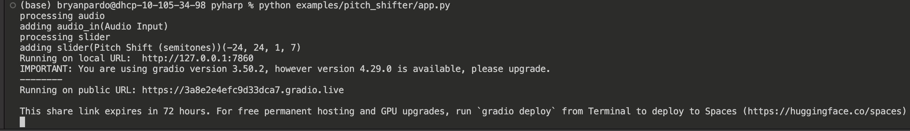
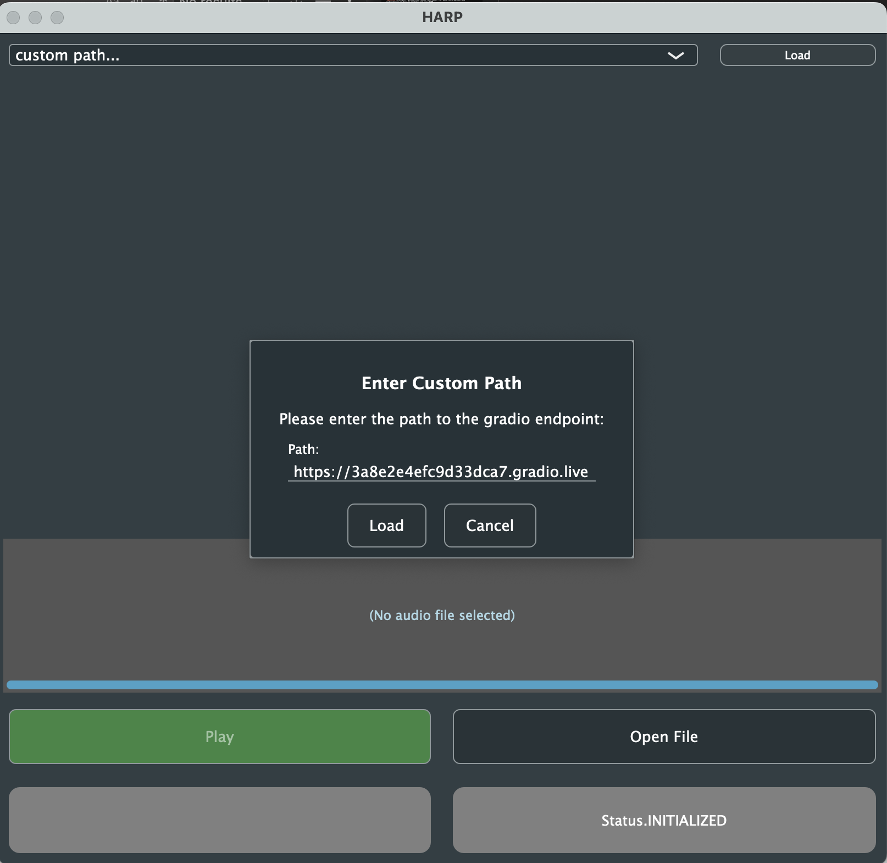

[](https://github.com/TEAMuP-dev/HARP)

PyHARP is a **companion package** for [HARP](https://github.com/TEAMuP-dev/HARP), an application which enables the seamless integration of machine learning models for audio into Digital Audio Workstations (DAWs). This repository provides a lightweight wrapper to embed **arbitrary Python code** for audio processing into [Gradio](https://www.gradio.app) endpoints which are accessible through HARP. In this way, HARP supports offline remote processing with algorithms or models that may be too resource-hungry to run on common hardware. HARP can be run as a standalone or from within DAWs that support external sample editing, such as [REAPER](https://www.reaper.fm), [Logic Pro X](https://www.apple.com/logic-pro/), or [Ableton Live](https://www.ableton.com/en/live/). Please see our [main repository](https://github.com/TEAMuP-dev/HARP) for more information and instructions on how to install and run HARP.

## Table of Contents
* **[Usage](#usage)**
    * **[Installing](#installing)**
    * **[Examples](#examples)**
    * **[Hosting Endpoints](#hosting-endpoints)**
    * **[Deploying to HARP](#deploying-to-HARP)**
* **[PyHARP Apps](#pyharp-apps)**
    * **[Model Card](#model-card)**
    * **[Processing Code](#processing-code)**
    * **[Gradio Endpoint](#gradio-endpoint)**
    * **[Pre-Trained Models](#pre-trained-models)**


# Usage
## Installing
If you plan on running or debugging a PyHARP app locally, you will need to install `pyharp`:
```bash
git clone https://github.com/TEAMuP-dev/pyharp
pip install -e pyharp
cd pyharp
```

## Examples
We provide several examples of how to create a PyHARP app under the `examples/` directory, along with a [template](examples/template/) for new apps. You can also find a list of models already deployed as PyHARP apps [here](https://github.com/TEAMuP-dev/HARP#available-models).

In order to run an app, you will need to install its corresponding dependencies. For example, to install the dependences for our [pitch shifter](examples/pitch_shifter/) example:

```bash
pip install -r examples/pitch_shifter/requirements.txt
```

The app can then be run with `app.py`:

```bash
python examples/pitch_shifter/app.py
```

This will create a local Gradio endpoint at the URL `http://localhost:<PORT>`, as well as a forwarded public Gradio endpoint at the URL `https://<RANDOM_ID>.gradio.live/`.

Below, you can see an example command line output after running `app.py`. It shows both the local endpoint (local URL) and the forwarded enpoint (public URL)



You can see your Gradio app in HARP by loading either the local URL or public URL as a custom path in HARP, as is shown below.




## Hosting Endpoints
Automatically generated Gradio endpoints are only available for 72 hours. If you'd like to keep the endpoint active and share it with other users, you can leverage [HuggingFace Spaces](https://huggingface.co/docs/hub/spaces-overview) (similar hosting services are also available) to host your PyHARP app indefinitely:

1. Create a new [HuggingFace Space](https://huggingface.co/new-space)
2. Clone the initialized repository locally:
```bash
git clone https://huggingface.co/spaces/<USERNAME>/<SPACE_NAME>
```
3. Add your files to the repository, commit, then push to the `main` branch:
```bash
git add .
git commit -m "initial commit"
git push -u origin main
```

Your PyHARP app will then begin running at `https://huggingface.co/spaces/<USERNAME>/<SPACE_NAME>`. The shorthand `<USERNAME>/<SPACE_NAME>` can also be used within HARP to reference the endpoint.

---

Here are a few tips and best-practices when dealing with HuggingFace Spaces:
- Spaces operate based off of the files in the `main` branch
- An [access token](https://huggingface.co/docs/hub/security-tokens) may be required to push commits to HuggingFace Spaces
- A `README.md` file with metadata will be created automatically when a Space is initialized
  - This file also controls the Gradio version used for the Space
  - HARP does not currently support the latest version of Gradio
    - We recommend using __version 4.7.1__ at this time
- A `requirements.txt` file specifying all dependencies must be included for a Space to work properly
- A `.gitignore` file should be added to maintain repository orderliness (_e.g._ to ignore `src/_outputs`)

## Deploying to HARP
PyHARP apps can be accessed from [within HARP](https://github.com/TEAMuP-dev/HARP#available-models) through the local or forwarded URL corresponding to their active Gradio endpoints ([see above](#examples)), or the URL corresponding to their dedicated hosting service ([see above](#hosting-endpoints)), if applicable.


# PyHARP Apps
## Model Card
A model card defines various attributes of a PyHARP app and helps users understand its intended use. This information is also parsed within HARP and displayed when the model is selected.

The following processing code corresponds to our [pitch shifter](examples/pitch_shifter/app.py) example:
```python
from pyharp import ModelCard


model_card = ModelCard(
    name="Pitch Shifter",
    description="A pitch shifting example for HARP.",
    author="Hugo Flores Garcia",
    tags=["example", "pitch shift"],
    midi_in=False,
    midi_out=False
)
```

## Processing Code
In PyHARP, arbitrary audio processing code is wrapped within a single function `process_fn`, for use with Gradio. The function should accept as an argument a path for input audio and should return a single path for output audio. Additional input arguments associated with the values of any [Gradio Components](https://www.gradio.app/docs/gradio/introduction) used as GUI controls can also be given.

<!--
This could be a source separation model, a text-to-music generation model, a music inpainting system, a librosa processing routine, etc.
-->

The following processing code corresponds to our [pitch shifter](examples/pitch_shifter/app.py) example:
```python
from pyharp import load_audio, save_audio

import torchaudio
import torch


@torch.inference_mode()
def process_fn(input_audio_path, pitch_shift_amount):
    sig = load_audio(input_audio_path)

    ps = torchaudio.transforms.PitchShift(
        sig.sample_rate,
        n_steps=pitch_shift_amount, 
        bins_per_octave=12, 
        n_fft=512
    ) 
    sig.audio_data = ps(sig.audio_data)

    output_audio_path = save_audio(sig)

    return output_audio_path
```

The function takes two arguments:
- `input_audio_path`: the filepath of the audio to process
- `pitch_shift`: the amount to pitch shift by (in semitones)

and returns:
- `output_audio_path`: the filepath of the processed audio

Note that this code uses the [audiotools](https://github.com/descriptinc/audiotools) library from Descript (installation instructions can be found [here](https://github.com/descriptinc/audiotools#installation)).

## Gradio Endpoint
The main Gradio code block for a PyHARP app consists of defining the input and output [Gradio Components](https://www.gradio.app/docs/gradio/introduction), which should include an [Audio](https://www.gradio.app/docs/gradio/audio) component for both the input and output, and launching the endpoint. The `build_endpoint` function connects the components to the I/O of `process_fn` and extracts HARP-readable metadata from the model card and components to include in the endpoint. Currently, HARP supports the [Slider](https://www.gradio.app/docs/gradio/slider) and [Textbox](https://www.gradio.app/docs/gradio/textbox) components as GUI controls.

The following endpoint code corresponds to our [pitch shifter](examples/pitch_shifter/app.py) example:
```python
from pyharp import build_endpoint

import gradio as gr


with gr.Blocks() as demo:
    # Define the Gradio interface
    components = [
        gr.Slider(
            minimum=-24, 
            maximum=24, 
            step=1, 
            value=7, 
            label="Pitch Shift (semitones)"
        ),
    ]

    # Build a HARP-compatible endpoint
    app = build_endpoint(model_card=model_card,
                         components=components,
                         process_fn=process_fn)

demo.queue()  # see the NOTE below
demo.launch(share=True)
```
**NOTE**: Make sure the order of the inputs matches the order of the arguments in `process_fn`. 

**NOTE**: All of the `gr.Audio` components MUST have `type="filepath"` in order to work with HARP.

**NOTE**: In order to be able to cancel an ongoing processing job within HARP, queueing in Gradio needs to be enabled by calling `demo.queue()`.

## Pre-Trained Models
If you want to build an endpoint that utilizes a pre-trained model, we recommend the following:
- Load the model outside of `process_fn`, so that it is only initialized once
- Store model weights within your app repository using [Git Large File Storage](https://git-lfs.com/)
