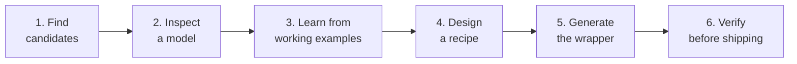

# How Model Deployment Works in HARP

*A plain-language orientation for newcomers. For the full command reference and
flags, see [`README.md`](./README.md).*

## What problem this solves

HARP is a desktop app that runs AI audio models on your audio. For HARP to use a
model, that model needs a small "wrapper" program (an `app.py`) that exposes it
in HARP's language. Writing that wrapper by hand — and finding good models in the
first place — is slow and requires expertise.

The **model agent** automates that work: it finds candidate models, learns from
wrappers that already work, drafts new wrappers (with or without an LLM), and
verifies them before you ship. The same features are available from a **GUI
widget inside HARP**, so a user can deploy a model without ever opening a
terminal.

## The pipeline at a glance

Most models only pass through a few of these stages. You rarely need all six.

### 1. Find candidates
Search Hugging Face (the "GitHub for AI models") for models worth considering —
not everything is already in HARP's featured list.
- `discover` — search for models by topic/author.

### 2. Inspect a model
- `probe` — **check a model that's already set up for HARP**: ask the live model
  what inputs it needs and what it produces (its sliders, buttons, and outputs),
  without downloading or running anything yourself.
- `score-card` — read a model's description and rate how easily it can be
  packaged (Is the license OK? Is it the right kind of task?).

### 3. Learn from working examples
- `harvest` — download the `app.py` wrappers from models that already work, so we
  have real, proven examples to learn from. It also doubles as a quick inventory:
  it writes an `index.json` marking each model `ok` / `missing` / `error`.
- `analyze` — report the input/output shapes those real wrappers use (purely by
  reading the code, never running it). Add `--check-health` to also ping each
  model and see if it is still alive (models can break after upstream updates).

### 4. Design a recipe
A **recipe** is a fill-in-the-blanks description of a wrapper. You can build one
three ways:
- `scaffold-recipe` — start from an existing wrapper; the agent fills in
  everything it can read automatically and marks the rest with `_todo`.
- `complete-recipe` — have an **LLM fill those `_todo` gaps** for you. The
  inputs/outputs stay locked to what the real wrapper used; the LLM only writes
  the missing dependencies and inference code.
- `generate-recipe-from-llm` — have an **LLM write an entire recipe from
  scratch** for *any* model, even frameworks we have no template for.
- `list-models` — see which LLM models your API key is allowed to use (handy when
  a model name is rejected).

### 5. Generate the wrapper
Turn a recipe (or a model card) into the actual files.
- `render-recipe` / `generate-recipe` — recipe → `app.py` / full package.
- `render-app` / `generate-package` — the *deterministic* (no-LLM) generator for
  frameworks we have a built-in template for (e.g. SpeechBrain).
- `package` / `package-repo` — bundle already-running endpoints, or fetch a raw
  model repo and package it in one step.

### 6. Verify before shipping
- `smoke-test` — actually **launch** the generated `app.py` and confirm it starts
  and responds. This is the real proof that a wrapper works. (It runs downloaded
  code, so do it after review or in a sandbox.) Add `--venv` to install the
  package's requirements into a throwaway, cached environment instead of your own.
- `deploy-space` — push the package to a **Hugging Face Space**, where its own
  container installs the dependencies and runs it. Easiest path for anyone with
  Hugging Face access to test end-to-end without local installs.

## Typical workflows

- **Known framework (fast, offline):** `render-app` / `generate-package` from a
  model card → `smoke-test`.
- **Any model (LLM-assisted):** `generate-recipe-from-llm --repo <id>` →
  `generate-recipe --smoke-test`.
- **Refine from a proven wrapper (most reliable):** `harvest` → `scaffold-recipe`
  → `complete-recipe` → `generate-recipe --smoke-test`.

The guiding principle for the LLM features is **"the LLM proposes, the
deterministic pipeline disposes"**: an LLM only writes the model-specific glue,
and that draft is always validated, rendered, and (optionally) smoke-tested
before you trust it. The output is a reviewable recipe, not opaque code.

## Glossary

| Term | Plain meaning |
|---|---|
| **HARP** | The desktop app that loads AI audio models and runs them on your audio. |
| **Model** | The trained AI (e.g. "separate vocals from a song"). |
| **Hugging Face** | The website where AI models live (like GitHub, but for models). |
| **Space** | A *running, hosted* model on Hugging Face you can send audio to. |
| **Endpoint** | The web address of a running model — where HARP sends audio and gets results back. |
| **Gradio** | The toolkit that turns a model into a web app with sliders/buttons. HARP talks to Gradio apps. |
| **pyHARP** | A small library that makes a Gradio app speak HARP's language. |
| **`app.py` / wrapper** | The glue program that loads a model and exposes it to HARP. The thing we automate. |
| **Model card** | A model's README plus metadata (author, license, task). |
| **Recipe** | A fill-in-the-blanks JSON describing a wrapper: inputs, outputs, dependencies, and inference code. |
| **Scaffold** | A half-filled recipe auto-derived from an existing wrapper, with `_todo` markers for the rest. |
| **Inference** | Actually running the model on input to produce output. |
| **Smoke-test** | A quick "does it even start and respond?" check — proof of life, not a full test. |
| **Package** | The folder of files (`app.py`, `requirements.txt`, `README.md`, manifest) ready to deploy as a Space. |
| **Manifest** | A small machine-readable summary of the package (task, inputs/outputs, entry point). |
| **LLM** | A large language model (e.g. Gemini, Claude, GPT) used here to write the model-specific glue code. |
