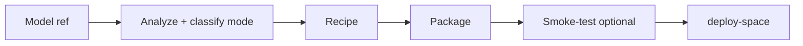

# HARP Model Agent

Package open-source audio models as HARP-compatible Hugging Face Spaces.

HARP talks to Gradio endpoints. This agent builds the wrapper Space: a
**recipe** (JSON) → a **package** (`app.py`, deps, README) → optional smoke-test
→ deploy. Prefer the one-command entry point; use the lower-level commands when
you need to inspect or customize a step.

Run everything from the **HARP repository root**:

```bash
python3 -m tools.model_agent <command> [options]
```

The HARP desktop app’s **Quick Deploy** window runs the same `deploy` command
(Preview = `--plan`, Deploy = `--yes`) with your saved HF / Gemini keys.

---

## Quick start

```bash
# Preview what would run (no deploy)
python3 -m tools.model_agent deploy <model-ref> --repo teamup-tech --plan

# Deploy (prompts y/N unless --yes)
python3 -m tools.model_agent deploy <model-ref> --repo teamup-tech --yes
```

`<model-ref>` can be:

- a GitHub URL or `owner/repo`
- a Hugging Face model id (`author/model`)
- a Hugging Face Space URL or id

`--repo` is the target Space: full `owner/name`, or just your org (e.g.
`teamup-tech`) — the Space name is taken from the model ref.

Environment:

| Variable | Purpose |
|----------|---------|
| `HF_TOKEN` / `HUGGING_FACE_HUB_TOKEN` | Push Spaces (`huggingface_hub`) |
| `GEMINI_API_KEY` (or Anthropic / OpenAI) | LLM recipe drafting |

---

## How deployment works



### Modes

The classifier (`recommend-mode` / internal to `deploy`) picks the lowest-friction
architecture that the signals allow:

| Mode | When | What you get |
|------|------|----------------|
| **single** | Model deps coexist with pyHARP | One Gradio Space: pyHARP wrapper + model |
| **remote** | An existing runnable backend Space is available (or `--space`) | Thin pyHARP proxy calling that Space via `gradio_client` |
| **dual** | Deps conflict with pyHARP, but the backend is pip-installable and Python ≤ 3.10 | One Docker Space: modern pyHARP frontend + isolated backend worker |
| **backend** | Same isolation need; you want a plain Gradio backend only (Phase 1 of two-space) | Backend Space with `/predict`; later `deploy --space <that>` for the HARP frontend |
| **two-space** | Isolation needed but dual cannot build (e.g. Python > 3.10) | Guidance / interactive choice of `dual` or `backend` when available |

Dual Spaces cannot install Python newer than **3.10** on the HF Docker image
(`DUAL_PYTHON_CEILING`). Models that need 3.11+ are steered away from dual.

### What a package contains

**Single / remote / backend (Gradio SDK):**

- `app.py` — wrapper (or plain Gradio backend)
- `requirements.txt`, optional `packages.txt`
- `README.md` — Space card (may set `python_version`)
- `.harp/manifest.json`

**Dual (Docker SDK):**

- `frontend_app.py`, `backend_worker.py`, `Dockerfile`, `start.sh`
- `requirements-frontend.txt`, `requirements-backend.txt`
- `README.md`, `.harp/manifest.json`

The agent does not vendor model **weights**; it may vendor small `.py` sources
into backend packages when a GitHub repo is not pip-installable.

---

## Commands

Live list: `python3 -m tools.model_agent --help`

### One-command deploy

```bash
python3 -m tools.model_agent deploy <ref> --repo <org|owner/name> [--plan|--yes]
# alias: port
```

Useful flags:

- `--space owner/space` — force remote proxy to that backend
- `--mode {auto,dual,backend}` — when isolation is needed
- `--user-token` / `--no-user-token` — optional HF token field on remote UIs (default: on)
- `--no-discover-space` — do not auto-find a backend Space from READMEs
- `--inputs` / `--outputs` — preferred I/O types for single-Space drafts
- `--recipe-output` / `--package-output` — where artifacts land

`deploy` prints a plan, then (unless `--plan`) asks for confirmation, then runs
the underlying recipe + package + `deploy-space` steps by calling the same CLI
subcommands.

### Mode recommendation and knowledge

```bash
python3 -m tools.model_agent recommend-mode --repo author/model
python3 -m tools.model_agent recommend-mode --github owner/repo
python3 -m tools.model_agent knowledge --find-repo author/model
python3 -m tools.model_agent knowledge --diagnose "paste error log here"
```

### Recipes and packages

```bash
# Deterministic remote proxy scaffold (live Gradio API / config)
python3 -m tools.model_agent scaffold-remote-recipe owner/backend-space --output recipe.json

# Render / write from a recipe JSON
python3 -m tools.model_agent render-recipe recipe.json
python3 -m tools.model_agent generate-recipe recipe.json --output artifacts/model_agent/generated
python3 -m tools.model_agent generate-recipe recipe.json --backend   # plain Gradio backend

# LLM draft (Gemini by default when GEMINI_API_KEY is set)
python3 -m tools.model_agent generate-recipe-from-llm \
  --repo author/model --inputs audio --outputs audio \
  --output artifacts/model_agent/recipes/model.json

python3 -m tools.model_agent generate-recipe-from-llm \
  --github owner/repo --generate-package --smoke-test --venv

# Fill _todo stubs in a partial recipe
python3 -m tools.model_agent complete-recipe partial.json --repo author/model

python3 -m tools.model_agent list-models --provider gemini
```

LLM grounding options include `--space`, `--github` / `--ref`, `--remote-space`,
`--backend`, `--dual`, `--inputs`, `--outputs`, `--provider`, `--llm-model`.

### Smoke-test and push

```bash
python3 -m tools.model_agent smoke-test artifacts/model_agent/generated/<pkg> --venv
python3 -m tools.model_agent deploy-space artifacts/model_agent/generated/<pkg> \
  --repo your-org/your-space
```

`deploy-space` needs `huggingface_hub` and a write token. Use `--into-space` to
overlay a wrapper onto an existing Space (e.g. a duplicate). Dual packages use
`--sdk docker`.

### Discovery (optional)

```bash
python3 -m tools.model_agent discover --query audio --author teamup-tech --limit 20
```

---

## Packaging behavior (implementation notes)

Aligned with current `cli.py` / `agent.py` / `classifier.py` / `recipe.py`:

- **PyPI preferred over `git+`** when a distribution name resolves on PyPI
  (avoids submodule/SSH and flat-layout setuptools failures).
- **Non-pip GitHub backends** can vendor top-level `.py` sources into
  `framework.vendor_files` instead of relying on `git+`.
- **Python version** for single/backend Spaces may be pinned from the strictest
  compatible ceiling of pinned deps’ PyPI `requires_python` metadata (floored
  at 3.10 when needed for wheels such as older TensorFlow / SciPy).
- **Remote scaffolds** read the live Space Gradio config for real dropdown
  choices and slider ranges when available.
- **Path safety:** generated packages refuse `extra_files` keys that escape the
  output directory (absolute paths / `..`).
- **SpeechBrain / framework-loadable HF cards** can still be treated as
  installable for single-Space mode even without a local `setup.py`.

Recipe I/O types: inputs `audio`, `file`, `dropdown`, `slider`, `textbox`,
`number`, `checkbox`; outputs `audio`, `file`, `labels` (and related HARP
shapes). Example recipes live under `tools/model_agent/examples/`.

---

## Safety

| Class | Commands / flags |
|-------|------------------|
| Offline / local files | `render-recipe`, `generate-recipe` (no smoke), recipe JSON edits |
| Network | `discover`, `scaffold-remote-recipe`, `generate-recipe-from-llm` (fetch), `deploy-space`, `deploy` |
| Runs model code | `smoke-test`, `--smoke-test`, `--venv` still executes the wrapper in an isolated env |

Prefer `--venv` for smoke tests so the host interpreter is not modified. Review
generated recipes and packages before `--yes` deploy.

---

## Tests

```bash
python3 -m unittest tools.model_agent.tests.test_agent
# or
python3 -m unittest discover -s tools/model_agent/tests -v
```

Offline; standard library only for the suite itself (some helpers may patch
network).

---

## File map

| Path | Role |
|------|------|
| `cli.py` / `__main__.py` | CLI, including `deploy` / `port` |
| `orchestrator.py` | Pure ref detection, mode planning, step argv lists |
| `classifier.py` | Dependency / Python / Gradio signals → mode |
| `agent.py` | HF/GitHub fetch, packaging, smoke-test, Space push, PyPI helpers |
| `recipe.py` | Validate / render recipes and packages |
| `llm.py` | LLM providers and recipe drafting prompts |
| `knowledge.py` + `knowledge/` | Deploy registry, locks, repair rules |
| `examples/` | Sample recipes and backend layouts |
| `tests/test_agent.py` | Regression suite |
| `docs/ai-handoffs/` | Engineering handoffs for agents |

GUI front-ends (HARP app, not under this folder):
`src/widgets/QuickDeployWidget.h`, `src/widgets/ModelAgentWidget.h`.
