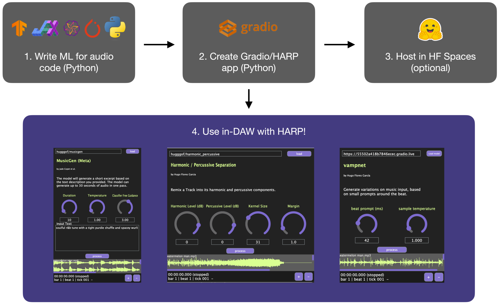

# HARP

HARP is an [ARA](https://www.synchroarts.com/blog/what-is-ara) plug-in that allows for **H**osted, **A**synchronous, **R**emote **P**rocessing of audio with deep learning models. HARP works by routing audio from a digital audio workstation ([DAW](https://en.wikipedia.org/wiki/Digital_audio_workstation)) through [Gradio](https://www.gradio.app) endpoints. Because Gradio apps can be hosted locally or in the cloud (e.g., HuggingFace Spaces), HARP lets users of Digital Audio Workstations (e.g. [Reaper](https://www.reaper.fm)) access large state-of-the-art models in the cloud, without breaking their within-DAW workflow.

# Our Team

<Team />
